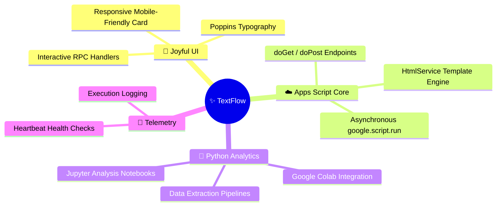
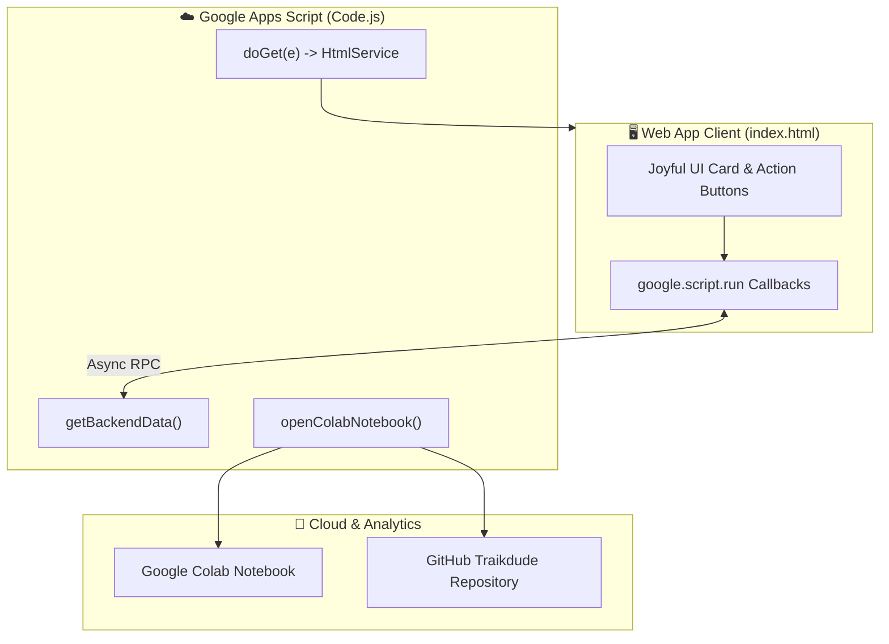

<!-- ✨ TEXTFLOW — REPOSITORY PRESENTATION (L3 SHOWCASE) -->

<div align="center">


# **✨ TextFlow**

**A lightweight, joyful cloud text processing web application and Python Colab integration pipeline built with Google Apps Script HtmlService and V8.**

[](#-core-features)
[](appsscript.json)
[](.clasp.json)
[](python/)
[](LICENSE)
[](https://github.com/traikdude/textflow)

<p align="center">
  <a href="#-overview"><b>Overview</b></a> •
  <a href="#-core-features"><b>Features</b></a> •
  <a href="#-architecture--rpc-pipeline"><b>Architecture</b></a> •
  <a href="#-python-colab-bridge"><b>Colab Bridge</b></a> •
  <a href="#-quick-start--clasp"><b>Quick Start</b></a> •
  <a href="#-contributing"><b>Contributing</b></a> •
  <a href="#-license"><b>License</b></a>
</p>

</div>

---

## 📑 Table of Contents

- [✨ Overview](#-overview)
- [🚀 Core Features](#-core-features)
  - [1. Joyful UI & Instant WebApp Deployment](#1-joyful-ui--instant-webapp-deployment)
  - [2. Google Apps Script HtmlService Engine](#2-google-apps-script-htmlservice-engine)
  - [3. Python & Google Colab Analytics Bridge](#3-python--google-colab-analytics-bridge)
  - [4. Real-Time Telemetry & Monitoring](#4-real-time-telemetry--monitoring)
- [🏗️ Architecture & RPC Pipeline](#-architecture--rpc-pipeline)
- [🐍 Python & Google Colab Bridge](#-python--google-colab-bridge)
- [⚡ Quick Start & Clasp Deployment](#-quick-start--clasp-deployment)
- [🗂️ Repository Structure](#-repository-structure)
- [🤝 Contributing](#-contributing)
- [📄 License](#-license)

---

## ✨ Overview

**TextFlow** is a lightweight Google Apps Script cloud text processing web application designed to demonstrate clean client-to-server RPC architecture and Python data analytics bridging.

Featuring a cheerful Joyful UI design system (warm pastel pink and electric sky blue gradients), modular Apps Script backend handlers (`Code.js`, `monitoring.gs`), and integrated Google Colab notebooks, TextFlow serves as a reliable micro-app template for Workspace developers.

---

## 🚀 Core Features



### 1. Joyful UI & Instant WebApp Deployment
Clean, accessible user interface built with modern CSS custom properties, Poppins typography, and instant feedback animations.

### 2. Google Apps Script HtmlService Engine
Renders dynamic HTML templates using `HtmlService.createTemplateFromFile()` with modular file inclusion helpers.

### 3. Python & Google Colab Analytics Bridge
Built-in helper dialogs to launch connected Google Colab research notebooks directly from the Apps Script runtime.

### 4. Real-Time Telemetry & Monitoring
Logs connection timestamps, server execution health, and trigger status via [`monitoring.gs`](monitoring.gs).

---

## 🏗️ Architecture & RPC Pipeline



---

## 🐍 Python & Google Colab Bridge

Open the linked analysis notebook directly from the Apps Script editor or webapp:

* **Notebook Path**: `python/notebooks/main_analysis.ipynb`
* **Colab Launcher**: Triggered via `openColabNotebook()` inside `Code.js`.

---

## ⚡ Quick Start & Clasp Deployment

### Prerequisites
* [Node.js](https://nodejs.org/) (v18+)
* [@google/clasp](https://www.npmjs.com/package/@google/clasp)

### Setup Instructions
1. Clone the repository:
   ```bash
   git clone https://github.com/traikdude/textflow.git
   cd textflow
   ```
2. Login to Google Apps Script:
   ```bash
   clasp login
   ```
3. Push changes to your Apps Script container:
   ```bash
   clasp push
   ```
4. Open the deployed web app:
   ```bash
   clasp open --webapp
   ```

---

## 🗂️ Repository Structure

```text
textflow/
├── docs/                        # Presentation & visual assets
│   └── assets/
│       └── banner.png           # L3 Showcase high-resolution hero banner
├── python/                      # Python analysis scripts & Colab notebooks
│   └── notebooks/
│       └── main_analysis.ipynb  # Primary text pipeline analysis
├── Code.js                      # Core Apps Script server endpoints
├── index.html                   # Joyful UI HTML template
├── monitoring.gs                # Telemetry & execution health logger
├── appsscript.json              # Apps Script project manifest
├── .clasp.json                  # Google Apps Script project binding
├── README.md                    # L3 Showcase presentation documentation
└── LICENSE                      # MIT Open Source License
```

---

## 🤝 Contributing

1. Fork the repository and create your branch (`git checkout -b feature/new-textflow-endpoint`).
2. Add new server endpoints in `Code.js` or UI components in `index.html`.
3. Push to your Apps Script sandbox via `clasp push`.
4. Submit a Pull Request.

---

## 📄 License

Distributed under the **MIT License**. See [LICENSE](LICENSE) for details.

---

<div align="center">

*Engineered for Joyful Cloud Computing, Workspace Automators & AI Agents.*  
**TextFlow · Google Apps Script · Python · Google Colab**

</div>
